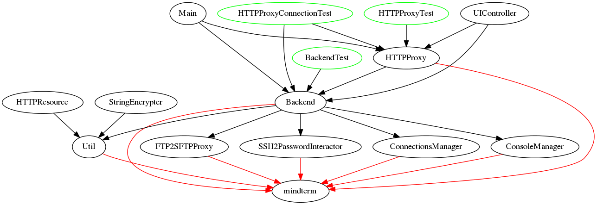

SSH backend migration plan
===

Currently, we have following classes that depend on `mindterm` library:

Refactoring should move along with the plan:

 - [ ] remove dependency from `HTTPProxy` class
 - [ ] remove dependency from `Util` class
 - [ ] extract interface from `Backend` class
 - [ ] use new interface everywhere
 - [ ] create (empty) alternative `Backend` implementation based on `sshj` or `jsch`
 - [ ] impement (temporarily) config option that allows to choose alternative `Backend` implementation
 - [ ] make alternative backend work, step by step
 - [ ] remove config option
 - [ ] remove old backend
 - [ ] clean all the things
